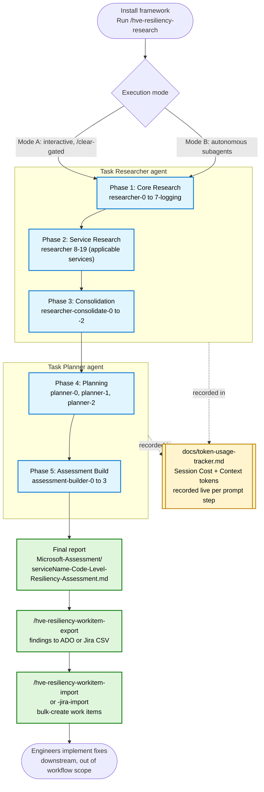
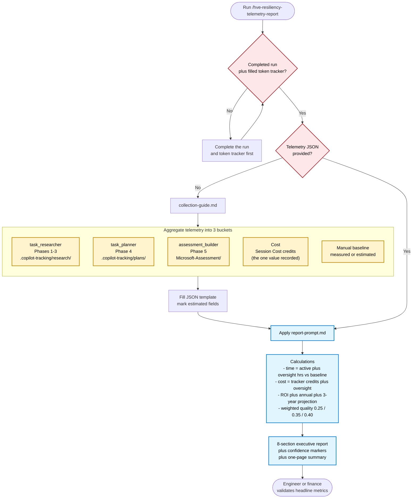

## Quick reference (cheatsheet)

Fast path for producing the report after a completed `hve-resiliency-research` run.

| Step | Action |
|------|--------|
| 1 | Confirm the run is complete: research in `.copilot-tracking/research/`, plans in `.copilot-tracking/plans/`, final report in `Microsoft-Assessment/`. |
| 2 | Confirm [token-usage-tracker.md](token-usage-tracker.md) has the Session Cost (credits) you recorded at the end of each stage. |
| 3 | Run `/hve-resiliency-telemetry-report`. |
| 4 | If prompted, follow [collection-guide.md](../.github/skills/hve-resiliency-telemetry-report/collection-guide.md) to fill the JSON (aggregate the tracker rows per bucket). |
| 5 | Review the 8-section report, verify confidence markers, then share the one-page summary. |

Command:

```text
/hve-resiliency-telemetry-report [telemetryJson=...]
```

Three telemetry buckets (aggregate the tracker rows into these):

| Bucket | Phases | Source |
|--------|--------|--------|
| `task_researcher` | 1-3 | `.copilot-tracking/research/` |
| `task_planner` | 4 | `.copilot-tracking/plans/` |
| `assessment_builder` | 5 | `Microsoft-Assessment/` |

Gotchas to remember:

* Cost comes from the token tracker's Session Cost credits (the one value you record), not a word-count estimate (word counts miss system, tool, and re-read tokens and understate cost).
* Session Cost is cumulative, so each stage cost is the difference from the previous stage's reading.
* Session Cost survives `/clear` but resets to zero on a brand-new chat session; record it before ending or restarting the chat.
* Include human oversight time in agent cost so ROI is not overstated.

## Overview

These two diagrams show the whole process at a glance. The first is the resiliency workflow that produces the assessment and backlog. The second is the telemetry report that measures a completed run and turns it into an executive ROI report.

The handoff between them is direct: the artifacts and token tracker produced in Diagram 1 are exactly the inputs Diagram 2 consumes.

## Diagram 1: Resiliency workflow (research to backlog)



## Diagram 2: Telemetry report (measures a completed run)



## Notes

* The telemetry buckets stop at `assessment_builder` (Phase 5). The "engineers implement fixes" node in Diagram 1 is downstream and intentionally out of scope for the report.
* Cost comes from the token tracker's measured Session Cost credits (recorded live per step), not a word-count estimate. Word counts miss the system prompt, tool definitions, tool results, and context re-reads, so they understate real cost.
* Human oversight time is included in agent-side cost so ROI is not overstated.
* Every headline metric must be validated by a qualified engineer or finance reviewer before the report is shared.
